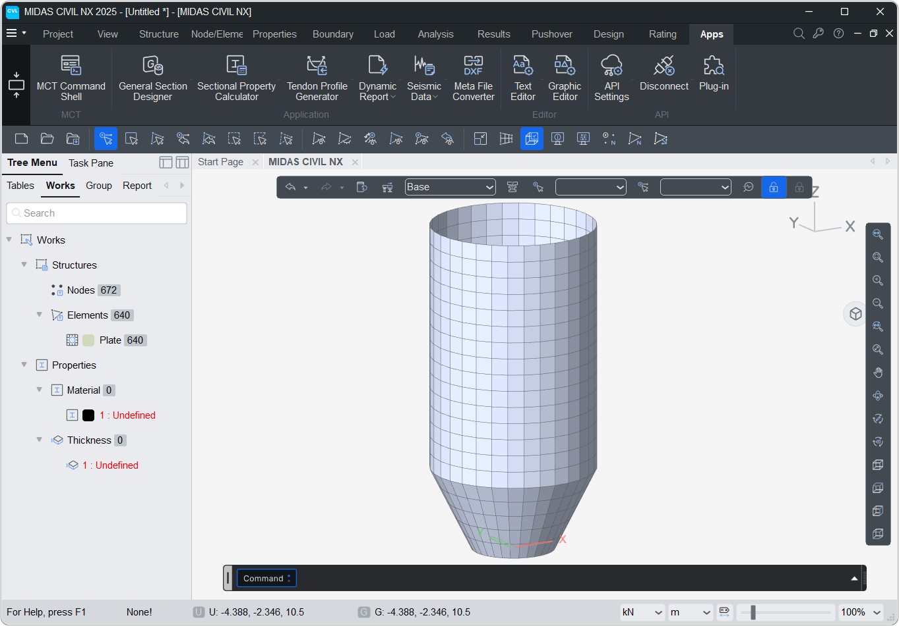

# 2D Elements


## PLATE

A nested class within Element used to create Plate elements.

#### Attributes

`ID`: Element ID  
`TYPE`: Element type = <font color="red">'PLATE'</font>  
`MATL`: Material ID of the beam element  
`SECT`: Section ID of the beam element  
`NODE`: Nodes of element in list. eg: [1,2,3,4]   
`ANGLE`: Beta angle of the beam element  
`STYPE`: Type of Plate element  
&emsp;&emsp;&emsp;&emsp;1 : Thick <font color="orange">&nbsp;&nbsp;|&nbsp;&nbsp;</font> 
2 : Thin  <font color="orange">&nbsp;&nbsp;|&nbsp;&nbsp;</font> 
3 : Thick w Drilling dof  <font color="orange">&nbsp;&nbsp;|&nbsp;&nbsp;</font> 
4 : Thin w Drilling dof 

### Constructor
**<font color="green">`Element.Plate(nodes:list, stype:int=1, mat = 1, sect = 1, angle = 0, id = 0)`</font>**  
Creates a Plate element.

#### Parameters
* `node`: Nodes of the Plate element
* `stype (default=3)`: Sub Type of Plate element   
&emsp;&emsp;&emsp;&emsp;
1 : Thick <font color="orange">&nbsp;&nbsp;|&nbsp;&nbsp;</font> 
2 : Thin  <font color="orange">&nbsp;&nbsp;|&nbsp;&nbsp;</font> 
3 : Thick w Drilling dof  <font color="orange">&nbsp;&nbsp;|&nbsp;&nbsp;</font> 
4 : Thin w Drilling dof  
* `mat (default=1)`: Material ID of the Plate element  
* `sect (default=1)`: Thickness ID of the Plate element  
* `angle (default=0)`: Beta angle of the Plate element  
* `id (default=0)`: Manually assign an ID.   If **0**, ID will be auto-assigned.  

#### Examples
```py
Node(0,0,0)
Node(1,0,0)
Node(1,1,0)
Node(0,1,0)
Element.Plate([1,2,3,4])

Node.create()
Element.create()
```


## Examples

### 1. Silo

```py
import math
R_top=5.0   # Radius at the top of Silo
R_bot = 2.5 # Radius at the bottom of Silo < R_top

H_tot=20.0 # Total height of Silo
H_tap = 5  # Height of tapered portion < H_tot

nR=32      # Sides of cylinder
nH=20      # Divisions along height

for q in range(nH+1):
    for i in range(nR):
        theta = i*2*math.pi/nR
        R = min(R_top,R_bot+q*H_tot/nH*(R_top-R_bot)/(H_tap))
        Node(R*math.sin(theta),R*math.cos(theta),q*H_tot/nH)

for q in range(nH):
    n_list = list(range(q*nR+1,(q+1)*nR+1))
    for i in range(nR):
        n1=n_list[i]
        n2=n_list[(i+1)%nR]
        Element.Plate([n1,n2,n2+nR,n1+nR])
        
Node.create()
Element.create()
```
