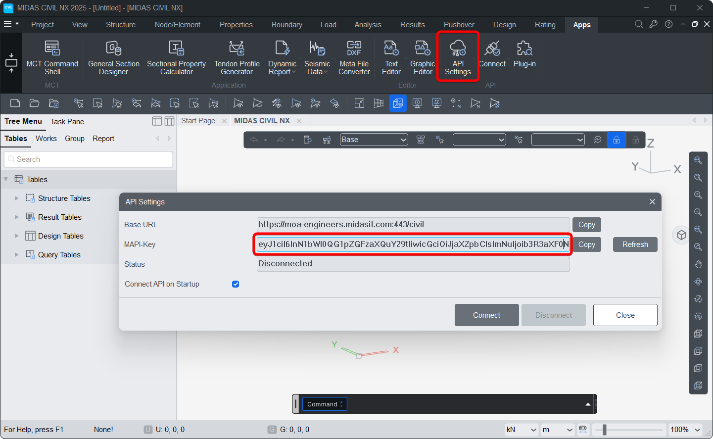

title: Introduction
summary: to MIDAS Python interface


This module provides a Python interface to interact with the MIDAS Civil NX API using HTTP requests. It includes functionality to manage the MAPI key required for authentication and to send API requests using various HTTP methods.


## Installation

Make sure you have Python 3 installed.
Install the MIDAS Python interface via Pip command.

```py
pip install midasapi
```
Additional libraries required by the modules are

* Numpy
* Polars
* xlsxwriter
* Requests 

---
To import the package use the import *

```py
from midasapi import *
```

---


## Functions available


### MAPI_KEY
Handles and stores the MIDAS API key used for authenticating requests.

```py
#Importing the midasapi package
from midasapi import * 

#Sets the MAPI Key for Python interface
MAPI_KEY('eyJ1ciI6InN1bWl0QG1pZGFzaXQuY29tIiwicGciO.252a81571d')
```




!!! info "NOTE :"
    * Ensure your MIDAS Civil NX application is open and connected.
    * The MAPI key used in your Python script must match the key in the Civil NX application.

---


### midasAPI
Send requests to MIDAS Civil NX.

#### Parameters :
* `method (str)`: HTTP method ("GET", "POST", "PUT", "DELETE")
* `command (str)`: API endpoint (e.g., "/db/NODE")
* `body (dict)`: Request payload (JSON format). Optional for "GET" and "DELETE"

#### Returns :

* A dict representing the JSON response from the API.

#### Example :
```py
#Importing the midasapi package
from midasapi import * 

#Sets the MAPI Key for Python interface
MAPI_KEY('eyJ1ciI6InN1bWl0QG1pZGFzaXQuY29tIiwicGciO252a81571d')

# Create a node
MidasAPI("PUT","/db/NODE",{{"Assign":{{"1":{{'X':0, 'Y':0, 'Z':0}}}}}})
```

---


### getID
Return ID of objects(Node,Element,Section,Material)


#### Parameters :
* `*objects (list)`: Objects or List of Objects of type Node, Element, Section and Material

    ⭐ Supports nested list

#### Returns :
* An array with ID of inputted objects

#### Example :
```py
from midasapi import *
MAPI_KEY('eyJ1ciI6InN1bWl0QG1pZGFzaXQuY29tIiwicGciO252a81571d')

Node(0,0,0,id=1)    # Create Node at 0,0,0 with ID = 1
Node(1,1,1,id=2)    # Create Node at 1,1,1 with ID = 2
Node(2,2,2,id=3)    # Create Node at 2,2,2 with ID = 3

beam_1 = Element.Beam(1,2)  # Create Beam connecting Node 1 and Node 2 (default ID = 1)
beam_2 = Element.Beam(2,3)  # Create Beam connecting Node 2 and Node 3 (default ID = 2)


print(getID(beam_1))
print(getID(beam_2))
print(getID(beam_1,beam_2))

#   Output :
#   [1]
#   [2]
#   [1, 2]
```

---


### getNodeID
Return Node ID of Element objects 

#### Parameters :
* `*objects (list)`: Objects or List of Objects of type Element(Beam, Truss...)

    ⭐ Supports nested list

#### Returns :
* An array with Node IDs of inputted objects

#### Example :
```py
from midasapi import *
MAPI_KEY('eyJ1ciI6InN1bWl0QG1pZGFzaXQuY29tIiwicGciO252a81571d')

Node(0,0,0,id=1)    # Create Node at 0,0,0 with ID = 1
Node(1,1,1,id=2)    # Create Node at 1,1,1 with ID = 2
Node(2,2,2,id=3)    # Create Node at 2,2,2 with ID = 3

beam_1 = Element.Beam(1,2)  # Create Beam connecting Node 1 and Node 2 (default ID = 1)
beam_2 = Element.Beam(2,3)  # Create Beam connecting Node 2 and Node 3 (default ID = 2)


print(getNodeID(beam_1))
print(getNodeID(beam_2))
print(getNodeID(beam_1,beam_2))

#   Output :
#   [[1, 2]]
#   [[2, 3]]
#   [[1, 2], [2, 3]]
```