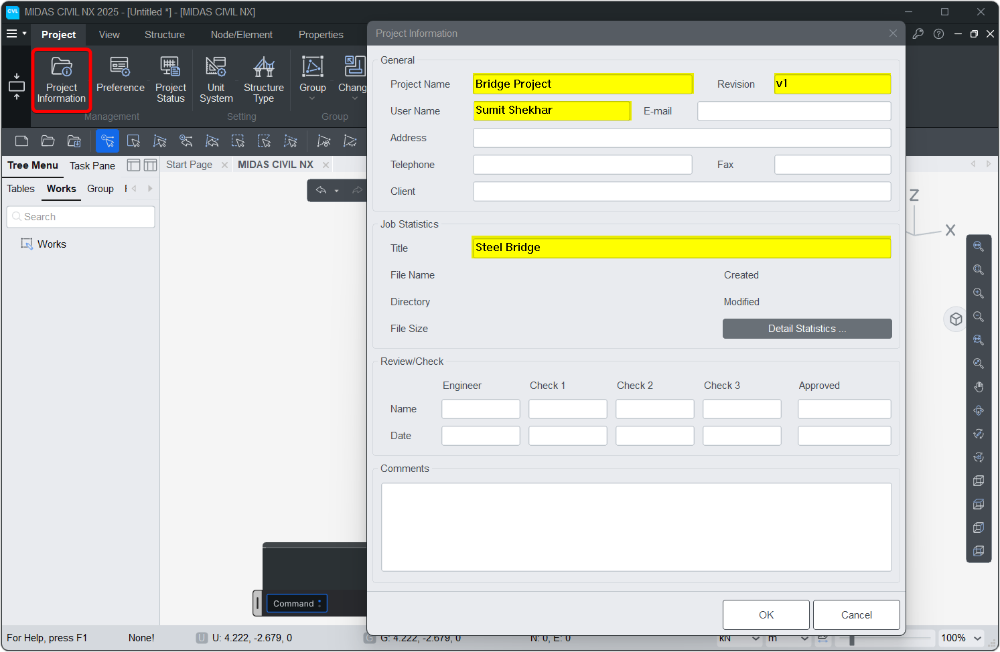
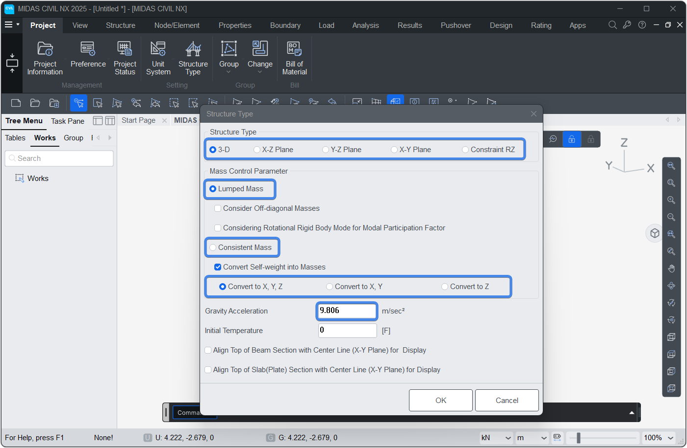

# Model

This manual provides detailed documentation of the Model class methods used for managing structural analysis models via Midas API.

## Methods

### <font style="font-size:0px">Model.</font>new
Creates a new model file.
```py
Model.new()
```


### <font style="font-size:0px">Model.</font>open
Opens an existing model file.


```py
Model.open("D://model.mcb")
```


### <font style="font-size:0px">Model.</font>save
Saves the current model. For first-time saves, provide a path.

!!! info "NOTE"
    If path is not provided for the first time GUI prompt will appear

```py
Model.save()
Model.save("D://model.mcb")
```

### <font style="font-size:0px">Model.</font>saveAs
Saves the model to the specified file path.
```py
Model.saveAs("D://model.mcb")
```


### <font style="font-size:0px">Model.</font>info
Sets the project information.  
`info(project_name="", revision="", user="", title="")`  


```py
Model.info(project_name="Bridge Project", revision="v1", user="Sumit Shekhar", title="Steel Bridge")

```



### <font style="font-size:0px">Model.</font>units
Sets the model's working units.  
`Model.units(force="KN", length="M", heat="BTU", temp="C")`  

#### Parameters
* `force`: KN, N, KGF, TONF, LBF, KIPS
* `length`: M, CM, MM, FT, IN
* `heat`: CAL, KCAL, J, KJ, BTU
* `temp`: C, F


```py
Model.units() # Set the SI unit system
Model.units(force='TONF') # Set the Force unit to Tonf
```
!!! info "NOTE :" 
    Make sure the units are in all caps


### <font style="font-size:0px">Model.</font>type
Sets structure and mass type information for the model.  
`Model.type(strc_type=0, mass_type=1, gravity=0, mass_dir=1)`  

#### Parameters
* `strc_type`: &nbsp;&nbsp;0 : 3D <font color="orange">&nbsp;&nbsp;|&nbsp;&nbsp;</font> 
1 : X-Z <font color="orange">&nbsp;&nbsp;|&nbsp;&nbsp;</font> 
2 : Y-Z  <font color="orange">&nbsp;&nbsp;|&nbsp;&nbsp;</font> 
3 : X-Y  <font color="orange">&nbsp;&nbsp;|&nbsp;&nbsp;</font> 
4 : RZ constraint  
* `mass_type`: &nbsp;&nbsp;1 : Lumped <font color="orange">&nbsp;&nbsp;|&nbsp;&nbsp;</font> 2 : Consistent  
* `gravity`: &nbsp;&nbsp; &nbsp;&nbsp;Gravity acceleration (l/t²)
* `mass_dir`: &nbsp;&nbsp;1 : Convert to XYZ <font color="orange">&nbsp;&nbsp;|&nbsp;&nbsp;</font> 
2 : Convert to XY <font color="orange">&nbsp;&nbsp;|&nbsp;&nbsp;</font> 
3 : Convert to Z only


```py
Model.type()
```



### <font style="font-size:0px">Model.</font>create
Creates all model components: materials, sections, nodes, elements, groups, and boundaries.  
>*Equivalent to executing all the create commands individually*
```py
Model.create()
```

### <font style="font-size:0px">Model.</font>clear
Clears all components in the model, including nodes, elements, materials, groups, loads, and boundaries.  
>*Equivalent to executing all the delete commands individually*
```py
Model.clear()
```
!!! info "NOTE"
    To save time, use individual delete commands eg. *Node.delete() ; Element.delete()*


### <font style="font-size:0px">Model.</font>analyse
Checks whether a model has been analyzed. If not, saves it and then analysis.

```py
Model.analyse()
```

### <font style="font-size:0px">Model.</font>select
Selects nodes and elements based on geometric criteria or material/section properties.

`Model.select(crit_1, crit_2, crit_3, st='a', en='a', tolerance=0)`  

#### Parameters
* `crit_1`: X, Y, Z, XY, YZ, ZX, USM (coordinate/system type)  
* `crit_2`: Coordinate or Material ID  
* `crit_3`: Coordinate or Section ID  
* `st, en`: Start and end range  
* `tolerance`: Tolerance for selection  

#### Returns
Dictionary with selected `'NODE'` and `'ELEM'` IDs.


```py
Model.select()
```
